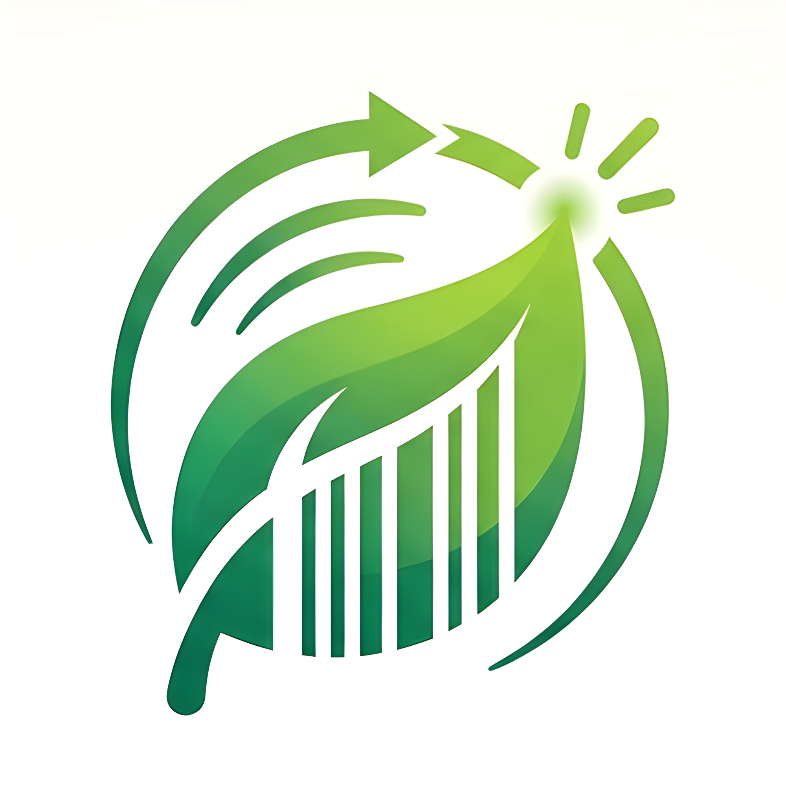
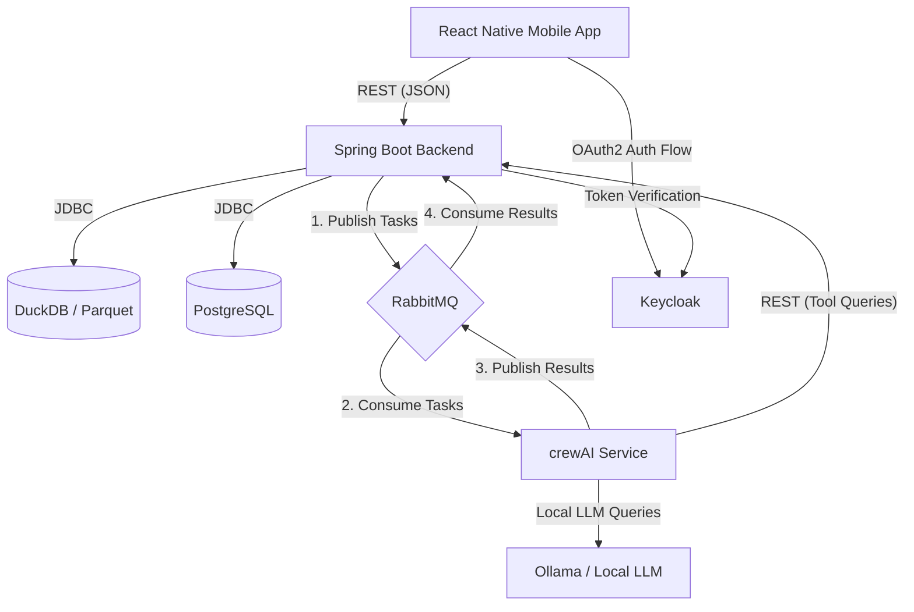

  

# EcoScan

**EcoScan** is a mobile app that enables to you track and analyze the ecological footprint of food products. By scanning barcodes on the go, EcoScan connects with a local Open Food Facts database and leverages intelligent AI agents to deliver detailed insights into the environmental impact of your daily choices.

For setting up your local environment, check the [Local Setup Guide](./SETUP.md).

> ⚠️ This app was built as a university project submission for a course module.

## 🚀 Features

- 📷 **Barcode-Scanner & Research**: Snap a picture of a barcode or enter an EAN manually to immediately retrieve raw product details from a local OpenFoodFacts dataset.
- 🚦 **Eco-Scoring & Analysis**: Translates complex product data into a simple "Green-Score" (0-100) using a color-coded traffic light system. Features category ratings for environmental, social, and health impacts, complete with short AI-generated justifications.
- 📍 **Local Alternatives & Geolocation**: Recommends alternative products with a higher score available nearby. Uses geolocational data to show store distances and open directions directly in Google Maps.
- 📉 **Impact Tracking & Scan History**: Saves your scan history and calculates cumulative CO2 savings over time. Keeps users motivated through visual statistics and weekly push notifications.

## ⚙️ Architecture & Communication

EcoScan is structured as a distributed microservices system utilizing both synchronous and asynchronous communication:

### Communication Protocols

- **REST APIs**: Used for all synchronous operations. The React Native mobile app communicates directly with the Spring Boot backend to register scans, load history, and query alternatives. Additionally, the Python-based crewAI service performs REST requests to query databases or fetch specific tool-related information from the backend. Keycloak acts as the OAuth2 Identity Provider, securing all API endpoints.
- **RabbitMQ Message Queue**: Used for bidirectional asynchronous processing. For example, hen a product is scanned and needs an in-depth ecological analysis:
   1. The backend publishes a task to the `ecoscan.ai.tasks.product-analysis` queue.
   2. The Python-based AI service consumes the task and runs the crewAI agent pipeline.
   3. The AI service publishes the results to the `ecoscan.ai.results.product-analysis` queue.
   4. The backend consumes the results, updates the database, and pushes the final evaluation to the mobile app via Server-Sent Events (SSE).

### Technology Stack

- **Frontend**: Expo, React Native (TypeScript), React Native Paper, React Native Reanimated, Expo Camera
- **Backend**: Java Spring Boot, Spring Data JPA, Flyway, Spring Security (OAuth2 Resource Server)
- **Databases**:
   - **DuckDB**: For high-performance analytical queries on the local Open Food Facts Parquet export
   - **PostgreSQL**: For storing transactional user data, scan history, and settings
- **AI Service**: crewAI (Python, uv, multi-agent orchestrator), Ollama (Local LLM runner)
- **Identity & Access Management**: Keycloak
- **Message Broker**: RabbitMQ

### 👥 Contributors

